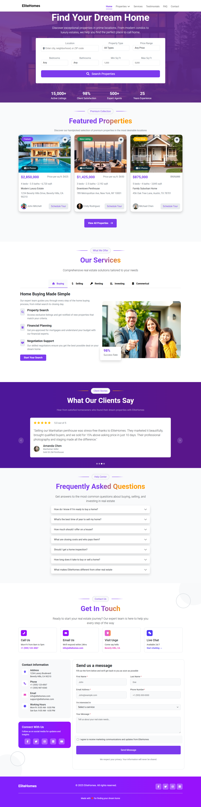
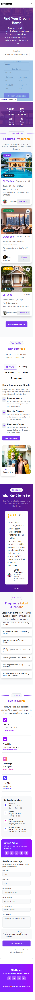

# 🏗️ EliteHomes - Your Dream Home Awaits & Construction Landing Page

A modern, responsive landing page designed for a construction and building company. This project showcases architectural services, ongoing projects, company milestones, and a seamless user experience tailored for corporate clients.

👉 **[Live Demo Link](https://mohab-elhashem.github.io/EliteHomes/)**

---

## 🛠️ Tech Stack

*   **HTML5 & CSS3** - Semantic structure and custom responsive layouts.
*   **Modern CSS** - Flexbox/Grid for layout architecture and smooth hover transitions.
*   **Bootstrap** - for structure and responsive design in all screen.
*   **Fontawesome** - for icons that heavier to upload.

---

## ✨ Features

*   **Modern Hero Section:** A bold introduction featuring high-quality structural imagery and a clear Call-to-Action (CTA).
*   **Services Grid:** Clean layout showcasing core competencies like architectural planning, building construction, and renovation.
*   **Project Portfolio:** A filterable or organized grid displaying completed and ongoing construction projects.
*   **Fully Responsive:** Optimized flawlessly for mobile, tablet, and desktop screens.
*   **Interactive UI elements:** Smooth scrolling, interactive navigation, and engaging hover effects on project cards.

---

## 📸 Preview

| Desktop View | Mobile View |
| :---: | :---: |
|  |  |

